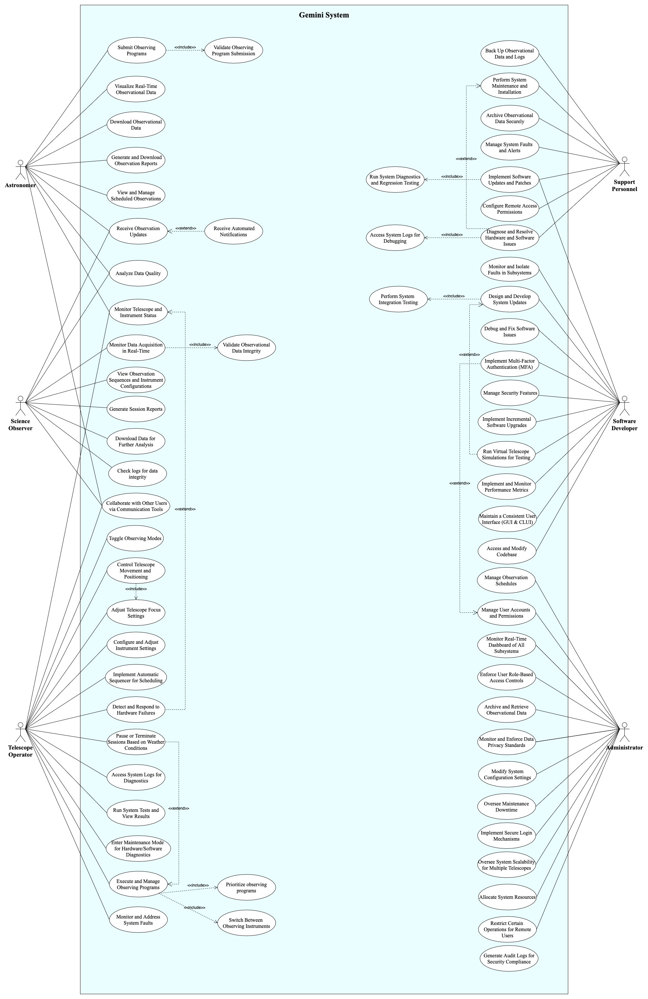

# Use Case Diagram for Gemini System

## Use Cases Explanation

### Actor : Astronomer  
1. **Submit Observing Programs**  
Astronomers can create, edit, and submit observing programs that define targets, observation sequences, and instrument configurations. Then, the system validates submissions to prevent errors.   

2. **Monitor Telescope and Instrument Status**  
Astronomers can monitor the status to ensure that observing conditions align with their program goals. This includes tracking system performance, instrument readiness, and environmental factors like weather conditions.   

3. **Receive Observation Updates**  
The system provides astronomers with live updates on the progress of their observations, including image acquisition status, system performance, and any modifications.   

4. **Receive Automated Notifications**  
If an observation schedule changes due to weather conditions, system faults, or priority adjustments, astronomers receive instant notifications via email, SMS, or system alerts.   

5. **Visualize Real-Time Observational Data**  
Astronomers can preview images and data being collected, such as raw images and signal-to-noise ratios, allowing them to assess observation quality in real-time.   

6. **Analyze Data Quality**  
The system provides tools to analyze observational data, including sky brightness, image focus, and exposure times, ensuring high-quality results before final storage.   

7. **Generate and Download Observation Reports**  
Astronomers can generate structured reports summarizing observations, system performance, and encountered issues, with options to download them in formats like PDF or CSV.   

8. **Collaborate with Other Users via Communication Tools**  
The system includes chat, video, and annotation tools to facilitate collaboration between astronomers, telescope operators, and science observers.   

9. **View and Manage Scheduled Observations**  
Astronomers can review upcoming and completed observations, modify schedules if needed, and prioritize certain observations based on real-time conditions.   

10. **Download Observational Data**  
Once observations are complete, astronomers can download data in standard formats like FITS for further analysis or archival purposes.   

11. **Validate Observing Program Submission**  
When an astronomer submits an observing program, the system verifies target visibility, instrument settings, and schedule constraints to prevent errors. If issues are detected, the astronomer is prompted to revise the submission before approval.   

### Actor : Science Observer  
1. **Monitor Data Acquisition in Real-Time**  
Science observers can oversee the telescope’s data collection process, ensuring that the system captures observations as expected.   

2. **Validate Observational Data Integrity**  
Observers can review incoming data for errors, inconsistencies, or missing information, helping maintain scientific accuracy.   

3. **Analyze Data Quality**  
The system provides analysis tools for observers to evaluate image quality, sky conditions, and instrument settings.   

4. **View Observation Sequences and Instrument Configurations**  
Observers can check detailed observation parameters, including exposure times, filters, and camera settings.   

5. **Collaborate with Other Users via Communication Tools**  
The system includes chat, video, and annotation tools to facilitate collaboration between astronomers, telescope operators, and science observers.   

6. **Receive Observation Updates**  
Science observers get real-time updates on observations, ensuring data quality and alerting them to issues.   

7. **Receive Automated Notifications**  
The system alerts observers about issues like hardware failures or environmental changes, ensuring rapid response.   

8. **Generate Session Reports**  
Observers can generate reports summarizing the session’s observational data, system performance, and any anomalies.   

9. **Download Data for Further Analysis**  
Observers can retrieve observational data in formats like FITS for detailed post-processing and validation.   

10. **Check Logs for Data Integrity**  
Observers can review system logs to verify that data acquisition processes ran smoothly and identify potential inconsistencies.   

### Actor : Telescope Operator
1. **Control Telescope Movement and Positioning**  
Operators can adjust the telescope’s orientation, ensuring it accurately tracks celestial objects for observations. 

3. **Configure and Adjust Instrument Settings** 
Operators can fine-tune instrument settings, such as camera exposure, filter selection, and sensor sensitivity, to match observation requirements. 

4. **Switch Between Observing Instruments** 
The system allows seamless transitions between different instruments without disrupting active operations. 

5. **Prioritize Observing Programs** 
Based on scientific importance and real-time conditions, operators can adjust the priority of scheduled observations. 

6. **Execute and Manage Observing Programs** 
Operators are responsible for launching observing programs, they use automatic sequencing to execute observations, but they can manually intervene if needed. 

7. **Implement Automatic Sequencer for Scheduling** 
The system automates scheduling to optimize efficiency, but operators can manually adjust sequences when necessary. 

8. **Adjust Telescope Focus Settings** 
Operators can fine-tune the telescope’s focus to ensure sharp and clear images. 

9. **Monitor and Address System Faults** 
Operators continuously track system status and respond to issues like instrument malfunctions or software failures. 

10. **Detect and Respond to Hardware Failures** 
The system alerts operators to hardware issues, allowing them to take corrective actions or switch to backup systems. 

11. **Pause or Terminate Sessions Based on Weather Conditions** 
If weather conditions become unsafe (e.g., high humidity, strong winds), the system automatically halts operations, but operators can pause or end observing sessions to protect equipment in specific cases. 

12. **Access System Logs for Diagnostics** 
Logs provide detailed records of operations, errors, and performance metrics to aid troubleshooting. 

13. **Collaborate with Other Users via Communication Tools** 
The system includes chat, video, and annotation tools to facilitate collaboration between astronomers, telescope operators, and science observers. 

14. **Run System Tests and View Results** 
Operators can perform diagnostics to verify system functionality and identify potential issues. 

15. **Enter Maintenance Mode for Hardware/Software Diagnostics** 
Operators can switch the system to maintenance mode to perform repairs, updates, or calibration procedures. 

16. **Toggle Observing Modes** 
Operators can switch between different observation modes (e.g., interactive, queue-based, remote) without restarting the system. 

17. **Monitor Telescope and Instrument Status** 
Telescope Operators are responsible for real-time monitoring of the telescope’s operational health, positioning, and instrument configurations. 
They ensure proper functioning during observations and address system, calibration, or environmental issues. 

### Actor : Support Personnel
1. **Perform System Maintenance and Installation** 
Support personnel install and maintain telescope hardware and software components, ensuring optimal system performance. This includes setting up new instruments and replacing faulty components. 

2. **Diagnose and Resolve Hardware and Software Issues** 
When technical failures occur, support personnel troubleshoot and resolve issues related to hardware malfunctions, network failures, or software bugs. 

3. **Access System Logs for Debugging** 
Support personnel review system logs to analyze errors, track anomalies, and identify potential faults for resolution. 

4. **Run System Diagnostics and Regression Testing** 
To ensure ongoing reliability, they execute diagnostic tests and regression testing after system updates to prevent new issues from arising. 

5. **Implement Software Updates and Patches** 
Support personnel deploy software updates, patches, and security fixes to enhance system performance and protect against vulnerabilities. 

6. **Archive Observational Data Securely** 
They manage the secure archiving of observational data to ensure long-term accessibility and compliance with data retention policies. 

7. **Back Up Observational Data and Logs** 
Regular backups of scientific data and system logs help prevent data loss in case of failures or accidental deletions. 

8. **Manage System Faults and Alerts** 
Support personnel monitor system alerts and respond proactively to faults to minimize operational disruptions. 

9. **Configure Remote Access Permissions** 
They manage access permissions for remote users, ensuring secure and restricted entry to the system based on user roles. 

### Actor : Software Developer
1. **Design and Develop System Updates** 
Software developers design and implement new features, enhancements, and bug fixes to improve system functionality. 

2. **Perform System Integration Testing** 
They conduct tests to ensure that newly developed software components integrate seamlessly with existing systems. 

3. **Implement Incremental Software Upgrades** 
Developers roll out software updates in small, manageable increments to reduce downtime and prevent major disruptions. 

4. **Access and Modify Codebase** 
They review, update, and optimize the codebase to enhance performance, introduce new capabilities, and fix bugs. 

5. **Run Virtual Telescope Simulations for Testing** 
Before deploying changes, developers use virtual telescope simulations to test software performance under real-world conditions. 

6. **Manage Security Features** 
Developers implement authentication protocols, encryption mechanisms, and other security measures to protect sensitive data. 

7. **Debug and Fix Software Issues** 
When system errors occur, they diagnose the root cause, develop fixes, and ensure stability. 

8. **Implement and Monitor Performance Metrics** 
Developers track system performance using key metrics to identify areas that need optimization. 

9. **Maintain a Consistent User Interface (GUI & CLUI)**  
They ensure a consistent and user-friendly experience across graphical (GUI) and command-line (CLUI) interfaces. 

10. **Implement Multi-Factor Authentication (MFA)**  
To enhance security, they integrate multi-factor authentication, requiring additional verification beyond a password. 

11. **Monitor and Isolate Faults in Subsystems**  
Developers identify, isolate, and troubleshoot faults in specific subsystems to prevent system-wide failures. 

12. **Implement Software Updates and Patches**  
Software developers create updates and patches, assist with complex deployments, and ensure system compatibility through integration testing. 

### Actor : Administrator
1. **Manage Observation Schedules**  
Administrators oversee the scheduling of observations, ensuring fair allocation of telescope time and avoiding conflicts. 

2. **Allocate System Resources**  
They optimize computing, storage, and networking resources to maintain system efficiency and support multiple users. 

3. **Oversee Maintenance Downtime**  
Administrators coordinate maintenance windows, ensuring minimal disruption to scheduled observations. 

4. **Modify System Configuration Settings**  
They adjust system settings, including network configurations, telescope parameters, and user access policies. 

5. **Enforce User Role-Based Access Controls**  
Administrators define user roles and permissions to ensure data security and prevent unauthorized access. 

6. **Archive and Retrieve Observational Data**  
They manage long-term data storage, ensuring compliance with archival policies and providing retrieval access when needed. 

7. **Generate Audit Logs for Security Compliance**  
Administrators generate and review security logs to detect potential breaches and maintain compliance with regulations. 

8. **Manage User Accounts and Permissions**  
They create, update, and deactivate user accounts while ensuring appropriate access privileges. 

9. **Oversee System Scalability for Multiple Telescopes**  
Administrators ensure that the system can scale to accommodate multiple telescopes and growing data demands. 

10. **Monitor and Enforce Data Privacy Standards**  
They enforce privacy policies to protect sensitive observational data and comply with ethical guidelines. 

11. **Implement Secure Login Mechanisms**  
Secure authentication mechanisms, such as encrypted logins and two-factor authentication, are managed by administrators. 

12. **Monitor Real-Time Dashboard of All Subsystems**  
They track system health through a real-time dashboard displaying telescope, network, and data acquisition statuses. 

13. **Restrict Certain Operations for Remote Users**  
Administrators limit the actions remote users can perform, such as pausing observations or accessing high-risk settings. 
